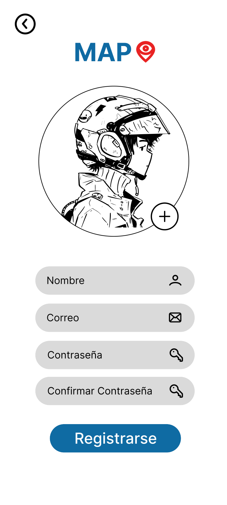
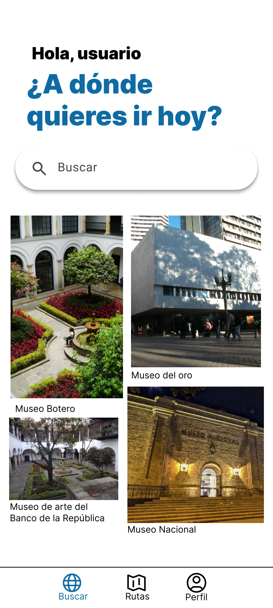
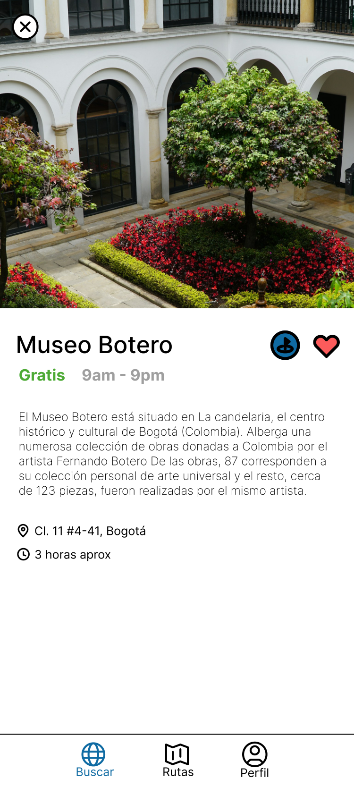
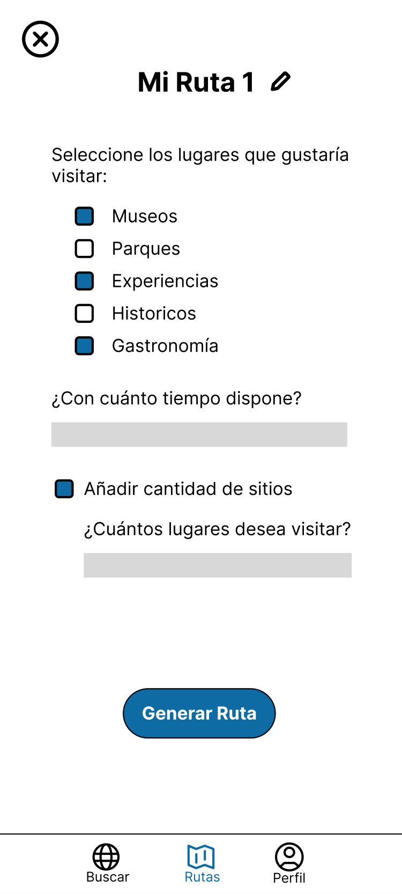
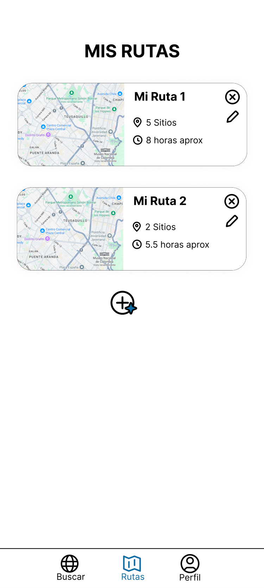
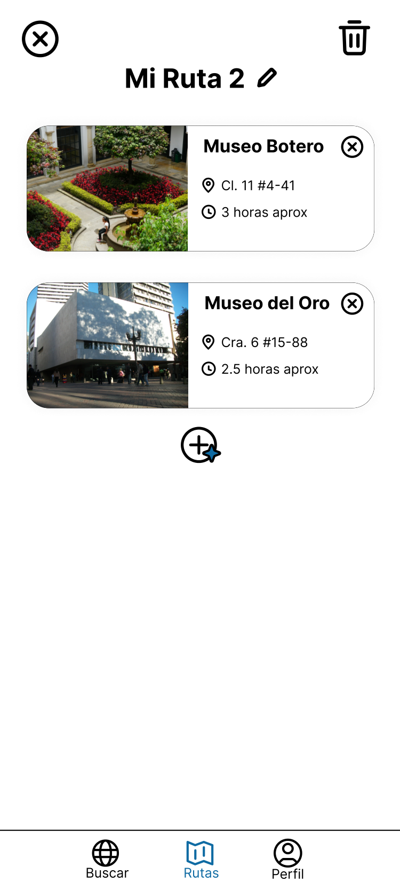
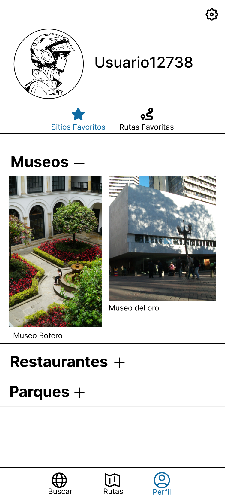
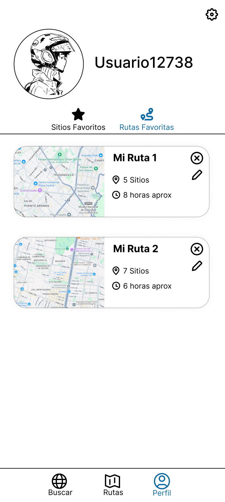

# MapU — App de Turismo

**MapU** es una aplicación móvil Android pensada para acompañar al turista (o al curioso local) en su recorrido por la ciudad. Permite explorar lugares de interés, guardarlos como favoritos y, sobre todo, **generar rutas turísticas personalizadas** a partir del tiempo disponible y los gustos del usuario.

La app nace como un proyecto académico orientado a integrar el uso de bases de datos en la nube con una experiencia de usuario fluida y centrada en el descubrimiento.

---

## Capturas y diseño

### Onboarding

  
  

### Autenticación

  
  

### Explorar y descubrir

  
  

### Rutas turísticas

  
  
  
  

### Perfil

  
  

---

## ¿Qué se puede hacer en la app?

### Autenticación
- Registro de usuarios con nombre, correo y contraseña.
- Inicio de sesión persistente: si el usuario ya está autenticado, la app entra directo a la pantalla principal.
- Validaciones a nivel de cliente: formato de correo, longitud mínima de contraseña, coincidencia de contraseñas, nombre solo con letras, etc.

### Explorar lugares
- Listado completo de lugares cargados desde Firestore.
- **Buscador en tiempo real** por nombre.
- **Filtro por categorías**: Museos, Parques, Recreativos, Históricos y Gastronomía/Restaurantes.
- Pantalla de detalle por lugar con imagen, dirección, descripción, tiempo estimado de visita y precio (gratis si es 0).

### Favoritos
- Marcar / desmarcar un lugar como favorito desde la pantalla de detalle.
- Vista de perfil con los favoritos **agrupados por categoría** en carruseles independientes.

### Rutas turísticas
- **Crear rutas manualmente** desde el flujo de detalle → "Guardar en categoría".
- **Generar rutas automáticas** indicando:
  - Nombre de la ruta.
  - Categorías de interés.
  - Tiempo disponible (1 a 8 horas).
- Algoritmo de generación:
  1. Toma todos los lugares que coinciden con las categorías elegidas.
  2. Selecciona un punto de referencia aleatorio.
  3. Ordena los lugares por **distancia geográfica** (fórmula del haversine sobre los `GeoPoint` de Firestore).
  4. Va añadiendo paradas mientras el tiempo acumulado quepa en el tiempo disponible.
- Guardado de la ruta generada en el perfil del usuario.
- Listado de rutas favoritas con vista de detalle por cada una.

### Tutorial / Onboarding
- Carrusel de bienvenida en tres pasos: explorar la ciudad, planear el recorrido y guardar/compartir viajes.
- Solo se muestra a usuarios no autenticados.

---

## Tecnologías

| Categoría | Stack |
|---|---|
| Lenguaje | Kotlin |
| Plataforma | Android (minSdk 24 · targetSdk 34 · compileSdk 34) |
| Build | Gradle (Kotlin DSL) + Version Catalog (`libs.versions.toml`) |
| UI | View System + ViewBinding + Material Components |
| Layouts | ConstraintLayout, CoordinatorLayout, Fragment Container |
| Navegación | AndroidX Navigation Component (Safe Args) + Bottom Navigation |
| Imágenes | Glide |
| Auth | Firebase Authentication |
| Base de datos | Cloud Firestore (con KTX) |
| Asincronía | Kotlinx Coroutines (`lifecycleScope`, `await()` sobre Tasks) |
| Testing | JUnit 4, AndroidX Test, Espresso |

### Versiones relevantes
- Android Gradle Plugin **8.4.0**
- Kotlin **1.9.0**
- Firebase Auth **23.0.0**, Firestore **25.1.x**
- Navigation **2.8.3**
- Glide **4.15.1**
- Material **1.12.0**

---

## Modelo de datos (Firestore)

La app trabaja con tres colecciones principales:

- **`usuarios`** — `{ id (correo), nombre, lugaresFavoritos: [idLugar], rutasFavoritas: [idRuta] }`
- **`lugares`** — `{ nombre, categoria, descripcion, direccion, imagenURL, precio, tiempo, geopoint }`
- **`rutas`** — `{ nombre, lugares: [idLugar] }`

Las clases Kotlin que mapean estos documentos son [Lugar.kt](app/src/main/java/com/example/app_bases_datos/Lugar.kt), [RutaModelo.kt](app/src/main/java/com/example/app_bases_datos/RutaModelo.kt) y [FavoritoLugar.kt](app/src/main/java/com/example/app_bases_datos/FavoritoLugar.kt).

---

## Funciones y utilidades

Las operaciones de Firestore están centralizadas en [utils/Utils.kt](app/src/main/java/com/example/app_bases_datos/utils/Utils.kt). Resumen de lo que ofrece:

### Usuarios
- `crearUsuario(correo, nombre)` — crea el documento del usuario tras el registro.
- `obtenerIdUsuario(correo, callback)` — resuelve el ID interno del documento a partir del correo.
- `nombreUsuario(email, textView)` — pinta el nombre del usuario en un `TextView`.
- `saludo(email, textView)` — muestra un "Hola, {nombre}" en pantalla.

### Lugares
- `crearLugar(nombre, categoria, descripcion, direccion, imagenURL, precio, tiempo)` — alta de un lugar (el `GeoPoint` se carga manualmente).
- `añadirLugar(idUsuario, idLugar)` / `eliminarLugar(idUsuario, idLugar)` — gestión de favoritos del usuario.
- `verificarLugarFavorito(idUsuario, idLugar, callback)` — comprueba si un lugar está marcado como favorito.
- `getDetallesLugares(idUsuario)` — log de todos los lugares favoritos de un usuario.

### Rutas
- `crearRuta(idUsuario, nombreRuta, callback)` — crea la ruta y la asocia al usuario.
- `eliminarRuta(idUsuario, idRuta)` — elimina la ruta del usuario y de la colección.
- `verificarRuta(idUsuario): Boolean` — `suspend` que indica si el usuario tiene al menos una ruta.
- `añadirLugarRuta(idRuta, idLugar)` / `eliminarLugarRuta(idRuta, idLugar)` — modifica las paradas de una ruta.
- `getDetallesRuta(idUsuario)` — log con los nombres de las rutas favoritas.

### Algoritmos relevantes
- **Distancia geográfica** (haversine) en [RutasParametros.kt](app/src/main/java/com/example/app_bases_datos/RutasParametros.kt) para ordenar paradas por cercanía.
- **Filtrado combinado** en [Buscar.kt](app/src/main/java/com/example/app_bases_datos/Buscar.kt) que cruza el texto del buscador con la lista de categorías recibida desde el fragmento de filtros.

---

## Cómo ejecutar el proyecto

### Requisitos
- Android Studio (Hedgehog o superior recomendado).
- JDK 17.
- Un proyecto en **Firebase** con **Authentication (Email/Password)** y **Cloud Firestore** habilitados.

### Pasos
1. Clona el repositorio.
2. Sustituye [app/google-services.json](app/google-services.json) por el `google-services.json` de tu propio proyecto Firebase.
3. Crea las colecciones `usuarios`, `lugares` y `rutas` en Firestore (los lugares requieren además un campo `geopoint` añadido manualmente).
4. Sincroniza Gradle y ejecuta sobre un emulador o dispositivo con **API 24+**.

> El `applicationId` actual es `com.example.app_bases_datos` y el `namespace` Android coincide con el mismo paquete.

---

## Estructura general de pantallas

| Pantalla | Archivo principal |
|---|---|
| Splash / Tutorial | [MainActivityTutorial.kt](app/src/main/java/com/example/app_bases_datos/MainActivityTutorial.kt) + `TutoFragment` / `TutoriFragment` / `TuFragment` |
| Login | [Login.kt](app/src/main/java/com/example/app_bases_datos/Login.kt) |
| Registro | [Registro.kt](app/src/main/java/com/example/app_bases_datos/Registro.kt) |
| Home con bottom navigation | [MainActivity.kt](app/src/main/java/com/example/app_bases_datos/MainActivity.kt) |
| Explorar / buscar | [Buscar.kt](app/src/main/java/com/example/app_bases_datos/Buscar.kt) + [FiltroBuscar.kt](app/src/main/java/com/example/app_bases_datos/FiltroBuscar.kt) |
| Detalle de un lugar | [Detalles_de_lugares.kt](app/src/main/java/com/example/app_bases_datos/Detalles_de_lugares.kt) |
| Guardar lugar en una ruta | [GuardarEnCategoria.kt](app/src/main/java/com/example/app_bases_datos/GuardarEnCategoria.kt) |
| Crear ruta vacía | [CrearRutaNueva.kt](app/src/main/java/com/example/app_bases_datos/CrearRutaNueva.kt) |
| Mis rutas / sin rutas | [Rutas.kt](app/src/main/java/com/example/app_bases_datos/Rutas.kt) · [RutasHome.kt](app/src/main/java/com/example/app_bases_datos/RutasHome.kt) · [NoRutas.kt](app/src/main/java/com/example/app_bases_datos/NoRutas.kt) |
| Generar ruta automática | [RutasParametros.kt](app/src/main/java/com/example/app_bases_datos/RutasParametros.kt) |
| Detalle de ruta | [RutasEscogidas.kt](app/src/main/java/com/example/app_bases_datos/RutasEscogidas.kt) · [DetallesLugarRuta.kt](app/src/main/java/com/example/app_bases_datos/DetallesLugarRuta.kt) |
| Perfil + favoritos por categoría | [Perfil.kt](app/src/main/java/com/example/app_bases_datos/Perfil.kt) |

---

## Notas

- El idioma de la interfaz es **español**.
- La actividad [DataTest.kt](app/src/main/java/com/example/app_bases_datos/DataTest.kt) es una pantalla auxiliar usada para poblar la base de datos a mano durante el desarrollo (creación de lugares, rutas, etc.). No forma parte del flujo de usuario final.
- El icono y el nombre de la app (`MapU`) están definidos en [strings.xml](app/src/main/res/values/strings.xml) y los recursos `mipmap/ic_logo*`.
